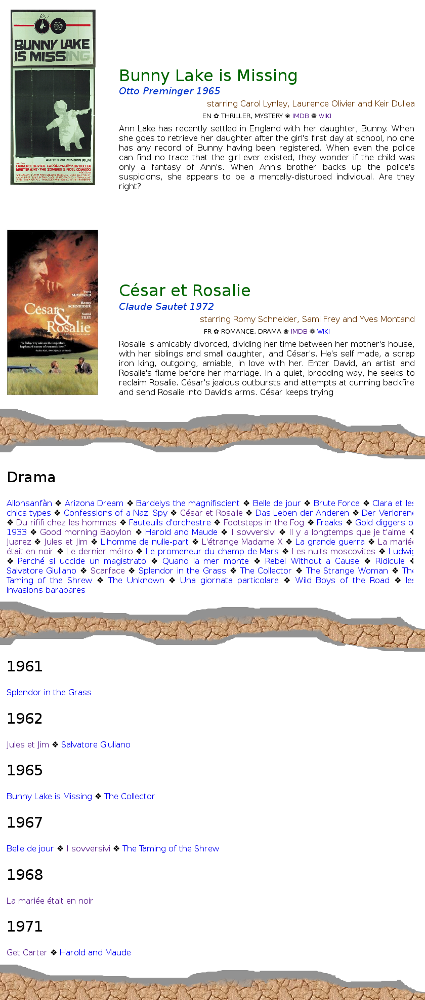

# Filmklub, a tool to produce static web pages for movie collections

We produce static web pages for movie collections, given a directory
containing Matroska-contained movies having two a attached files: a
+POSTER file containing the poster of the movie and an +INDEX file
looking like:

```
Title: Jules et Jim
Language: fr, de
Year: 1962
IMDB: 0055032
Wikipedia: fr Jules_et_Jim_(film)
```

The script fetches additional movie information from the IMDB and
prepares static HTML pages, where our movie collections can be browsed
alphabetically, by genre, by actors, by years, and so on. Here is a
montage involving several of the generated pages:


